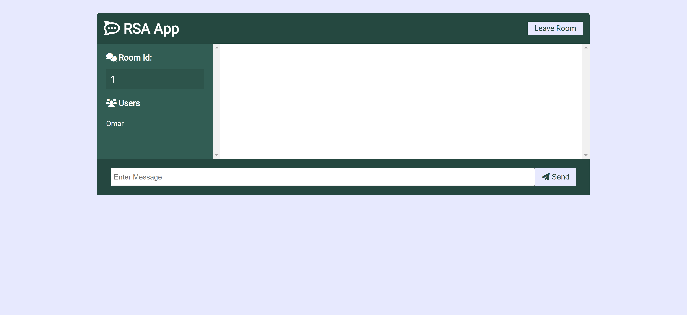

# RSA chat App
Realtime chat app with websockets using Node.js, Express, Socket.io & mongo database with Vanilla JS on the frontend with a custom UI. this chat system encrypt & decrypt messages using RSA encryption algorithm.

## Usage
```
npm install
npm start
Go to localhost:3000
```
# Screenshots
### Register page

### Chat Room

### Join into a room

### Sending message

